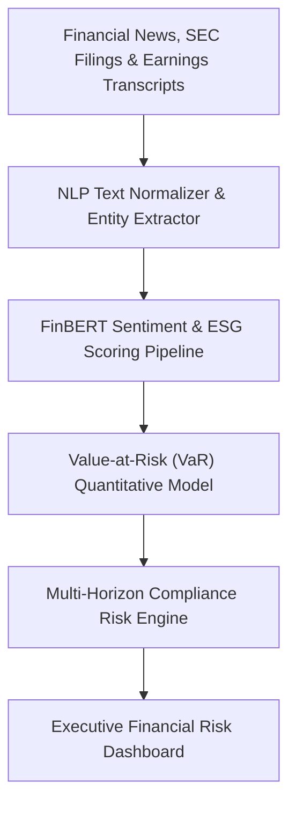
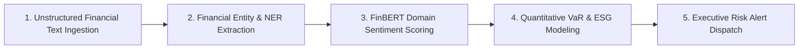

# 🔍 RiskLens AI — Evidence-First Banking Transaction Risk Investigation Assistant
### *AI-Powered Financial Fraud Detection, Anomaly Scoring & Regulatory Audit Dossier Generator for Banking Analysts*

    

  <a href="https://github.com/Tharun4743/RiskLens-AI">📦 <b>Official GitHub Repository</b></a>
  
  

---

## 1. 📌 Problem Statement & Context
Commercial banks, payment processors, and fintech platforms face overwhelming operational bottlenecks in Anti-Money Laundering (AML) and fraud detection:

* 🌊 **Inundation of False Positives:** Legacy rules-based banking filters flag tens of thousands of transactions daily, with false-positive rates exceeding 90%, burying genuine money laundering in noise.
* ⏱️ **Labor-Intensive Manual Case Review:** Compliance analysts spend 2–4 hours manually auditing historical account ledgers, calculating velocity ratios, and cross-referencing high-risk merchants.
* 📄 **Tedious Regulatory Filing Bottlenecks:** Drafting Suspicious Activity Reports (SARs) requires hours of tedious narrative synthesis, causing massive regulatory backlogs and compliance penalty exposure.
* 🔍 **Lack of Explainable Evidence Trails:** Black-box machine learning models output arbitrary risk probabilities without citing the exact timestamped transactions that triggered suspicion.

---

## 2. 🔍 Existing Solutions & Critical Gaps
| Compliance Capability | Legacy Rules Engines | Generic AutoML Classifiers | 🔍 RiskLens AI Platform |
| :--- | :---: | :---: | :---: |
| **False-Positive Reduction** | ❌ Rigid >90% False Positives | ⚠️ Moderate Improvement | ✅ Multidimensional Behavioral Profiling |
| **Evidence-First Citing** | ❌ Opaque Rule Trigger | ❌ Unexplainable Black-Box | ✅ Cites Specific Transaction IDs & Thresholds |
| **Automated SAR Generation**| ❌ Manual Drafting (Hours) | ❌ None | ✅ Structured LLM Audit Dossier Synthesis |
| **Velocity & Structuring Check**| ⚠️ Basic Single-Rule Flag | ⚠️ Statistical Deviation | ✅ Rapid Pass-Through & Smurfing Detection |
| **Analyst Investigation Time** | ⏳ 2 to 4 Hours per Case | ⏳ 1 to 2 Hours per Case | ⚡ Sub-5 Minutes per Case |

### ⚠️ Critical Limitations of Existing Alternatives:
* 🚫 **Disconnected Forensic Context:** Compliance officers must manually copy transaction rows between ledger databases and word processors.
* 🛑 **Regulatory Non-Compliance Risk:** Failure to file accurate SAR reports within statutory deadlines exposes banks to multi-million dollar regulatory fines.
* 📴 **Unexplainable Machine Predictions:** Banking regulators reject black-box AI recommendations that cannot provide clear mathematical justifications.

---

## 3. 💡 Proposed Solution & Architectural Innovation
**RiskLens AI** is an intelligent, evidence-first financial transaction risk investigation platform engineered to empower AML compliance analysts:

* 📊 **Multidimensional Anomaly Scoring:** Uses unsupervised behavioral clustering (Isolation Forest / DBSCAN) to score rapid velocity spikes, circular funds routing, and high-risk merchant anomalies.
* 🔍 **Evidence-First Forensic Anchoring:** Every risk flag is explicitly tied to concrete transaction records, timestamp differentials, and monetary structuring thresholds.
* 📑 **Automated Regulatory SAR Dossier Synthesis:** Structured LLM pipeline automatically drafts regulatory-compliant Suspicious Activity Report narratives, citing exact account histories.
* 🖥️ **Interactive Financial Analyst Dashboard:** Visualizes transaction flow timelines, velocity distribution heatmaps, and suspicious merchant category clusters.
* 🛡️ **Enterprise Data Governance:** Engineered for on-premise or private cloud deployment, keeping confidential banking ledger records strictly within internal compliance perimeters.

---

## 4. ⚙️ Technical Approach & System Architecture

### 📐 High-Level Architectural Flowchart:

| Pipeline Layer | Technologies Used | Operational Function |
| :--- | :--- | :--- |
| **Ingestion & Normalization**| Python 3.10+, Pandas, NumPy | Cleans raw banking transaction records, parses timestamps, and structures merchant categories |
| **Statistical Anomaly Core** | Scikit-Learn (Isolation Forests) | Evaluates transaction velocity deviations, smurfing patterns, and account dormancy breaks |
| **Regulatory AI Engine** | Structured LLM Inference | Generates standardized narrative investigation dossiers citing precise transaction IDs |
| **Analyst Workspace** | Streamlit / React Dashboard | Visualizes transaction network graphs, risk timelines, and one-click SAR export controls |

### 🔄 End-to-End Operational Lifecycle Workflow:

1. **Transaction Ingestion:** Banking transaction logs ingested via secure CSV/API feed → Normalizer computes historical baseline behavior.
2. **Anomaly Scoring:** Machine learning pipeline identifies pass-through structuring and velocity anomalies → Generates composite risk score.
3. **Evidence Dossier Generation:** System compiles flagged transactions → LLM synthesizes evidence-first SAR narrative → Compliance officer reviews and submits.

---

## 5. 📈 Quantifiable Impact & Measurable Benefits
* ⚡ **80% Reduction in Investigation Time:** Slashes case auditing time from 3 hours down to under 15 minutes per suspicious account.
* 🔍 **100% Explainable Forensic Reports:** Guarantees every flagged suspicion is backed by timestamped monetary transaction citations.
* ⚖️ **Enhanced Regulatory Compliance:** Eliminates SAR backlog and drastically reduces regulatory penalty exposure for financial institutions.

---

## 6. 🚀 Feasibility, Operational Viability & Scalability
* 🔬 **Technical Feasibility:** Python data pipeline readily integrates with standard banking core data lakes and transactional event streams.
* 💰 **Economic & Financial Viability:** Delivers immense cost savings by automating repetitive compliance analyst tasks and preventing regulatory fines.
* 🏛️ **Operational Governance:** Intuitive analyst dashboard requires zero machine learning knowledge from compliance officers.
* 📈 **Horizontal Scalability Roadmap:** Readily scales to millions of daily transactions using distributed data tools like Apache Spark or Ray.

---

## 7. 👨‍💻 Author & Intellectual Property License

### Lead Architect & Author
**Tharunkumar K** ([@Tharun4743](https://github.com/Tharun4743))
* 🎓 B.Tech Information Technology • V.S.B. Engineering College, Karur
* 🌐 [GitHub Profile](https://github.com/Tharun4743) • [LinkedIn](https://linkedin.com/in/tharunkumark4743) • [Personal Portfolio](https://tharunkumark4743.netlify.app)

### 🔒 Proprietary License Notice (All Rights Reserved)
> [!CAUTION]
> **PROPRIETARY & CONFIDENTIAL INTELLECTUAL PROPERTY**
> 
> All rights reserved. This repository, its architecture, source code, workflows, firmware, and associated documentation are the exclusive intellectual property of **Tharunkumar K**.
> 
> **No entity, organization, or individual is permitted to copy, modify, distribute, publish, commercially exploit, reverse engineer, or deploy any portion of this project without express, prior written permission from the author.**
> 
> **Copyright © 2026 Tharunkumar K. All Rights Reserved.**
